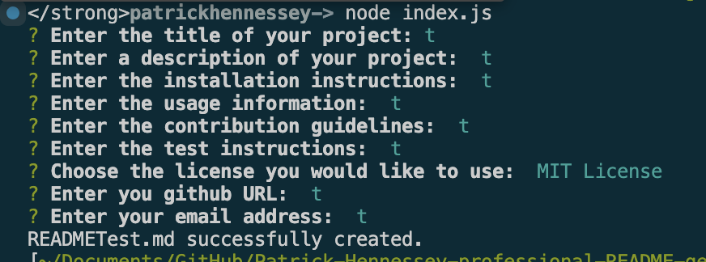

# Patrick Hennessey's README Generator

## Description
        
This application uses Node.js and a command-line application to dynamically generate a high-quality and professional README after a series of prompts from the user. The README contains what the app is for, how to use the app, how to install it, how to report issues, and how to make contributions. The prompts are rendered using the Inquirer package.
        
## Table of Contents
        
- [Installation](#installation)
- [Usage](#usage)
- [Credits](#credits)
- [License](#license)
        
## Installation
        
In order to use this application, the user needs Node.js, a command-line application, and the inquirer package installed. 
        
## Usage
        
To run the applicaton simply run "node index.js" in the command-line

        
## Credits
        
GitHub: https://github.com/RickHennessey87
Email: pjhennessey89@gmail.com

## License
    
This project is covered by the MIT License license.

[MIT License](https://opensource.org/licenses/MIT)
        
## How to Contribute 

No contributions needed.
        
## Tests
        
No tests available 